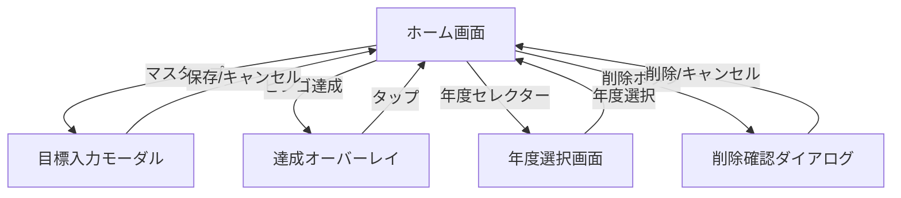

# UIワイヤーフレーム: bingo_goal_app

## 画面一覧

| ID | 画面名 | タイプ | URL | 対応ストーリー |
|----|--------|--------|-----|---------------|
| SC001 | ホーム画面 | ページ | / | ST001,ST003,ST005-ST007 |
| SC002 | 目標入力モーダル | モーダル | - | ST005 |
| SC003 | ビンゴ達成オーバーレイ | オーバーレイ | - | ST008,ST009 |
| SC004 | 年度選択画面 | ページ | /boards | ST002,ST003 |
| SC005 | 削除確認ダイアログ | ダイアログ | - | ST004 |

---

## SC001: ホーム画面（メイン）

### モバイル版（375px）

```
┌─────────────────────────────────┐
│  ◯ Bingo Goals    [2026 ▼] ⚙️  │  ← ヘッダー
├─────────────────────────────────┤
│                                 │
│   ┌───────┬───────┬───────┐    │
│   │       │       │  ✓    │    │
│   │ 本を  │ 5kg   │ 英語  │    │
│   │ 読む  │ 痩せる│ 勉強  │    │
│   ├───────┼───────┼───────┤    │  ← ビンゴボード
│   │  ✓    │       │       │    │
│   │ 貯金  │ 旅行  │ 資格  │    │
│   │ 50万  │ 3回   │ 取得  │    │
│   ├───────┼───────┼───────┤    │
│   │       │  ✓    │       │    │
│   │ 運動  │ 映画  │ 料理  │    │
│   │ 週2回 │ 12本  │ 上達  │    │
│   └───────┴───────┴───────┘    │
│                                 │
│         4/9 達成  1 BINGO!      │  ← 進捗表示
│      あと1マスでダブルビンゴ！   │
│                                 │
├─────────────────────────────────┤
│        [ + 新規作成 ]           │  ← フッター
└─────────────────────────────────┘
```

### コンポーネント詳細

**CP001: ヘッダー**
- 左: アプリロゴ（アイコン + "Bingo Goals"）
- 中央: 年度セレクター（ドロップダウン）
- 右: 設定アイコン（歯車）

**CP002: ビンゴボード**
- 3x3グリッド
- 各マス: 80px × 80px（モバイル）
- 達成マス: 緑色背景 + チェックマーク
- 未達成マス: 薄いグレー背景
- タップで入力モーダル、長押しで達成切替

**CP003: 進捗表示**
- 「4/9 達成」: 達成数/全マス
- 「1 BINGO!」: ビンゴ達成数
- ヒント: 「あと○マスで...」

---

## SC002: 目標入力モーダル

```
┌─────────────────────────────────┐
│                                 │
│  ┌─────────────────────────────┐│
│  │  ✕                          ││
│  │                             ││
│  │  左上のマスを編集            ││
│  │                             ││
│  │  ┌─────────────────────┐   ││
│  │  │ 本を12冊読む        │   ││
│  │  └─────────────────────┘   ││
│  │            0/50文字         ││
│  │                             ││
│  │  ┌────────┐  ┌────────┐   ││
│  │  │ クリア │  │  保存  │   ││
│  │  └────────┘  └────────┘   ││
│  │                             ││
│  └─────────────────────────────┘│
│                                 │
└─────────────────────────────────┘
```

**コンポーネント:**
- 位置表示: 「左上」「中央」「右下」など
- テキスト入力: 1行、最大50文字
- 文字カウンター: 「12/50文字」
- 保存ボタン: プライマリカラー
- クリアボタン: セカンダリ（入力済みの場合のみ表示）
- ✕ボタン: 右上、タップで閉じる

---

## SC003: ビンゴ達成オーバーレイ

```
┌─────────────────────────────────┐
│                                 │
│       🎉  🎊  🎉  🎊  🎉        │
│                                 │
│                                 │
│           B I N G O !           │  ← 大きなテキスト
│                                 │
│          ダブルビンゴ達成！      │
│                                 │
│       🎉  🎊  🎉  🎊  🎉        │
│                                 │
│                                 │
│       [ タップして閉じる ]      │
│                                 │
└─────────────────────────────────┘
```

**コンポーネント:**
- 背景: 半透明オーバーレイ（ダークグレー）
- 「BINGO!」: 大きく、ゴールド色、アニメーション
- 達成数表示: 「ダブルビンゴ達成！」「トリプルビンゴ！」
- 紙吹雪アニメーション: 画面上部から落下
- タップで閉じる or 自動で3秒後に閉じる

---

## SC004: 年度選択画面

```
┌─────────────────────────────────┐
│  ← 戻る          年度選択       │
├─────────────────────────────────┤
│                                 │
│  ┌─────────────────────────────┐│
│  │  2026年                     ││
│  │  5/9 達成  1 BINGO          ││
│  │  [████████░░] 56%           ││
│  └─────────────────────────────┘│
│                                 │
│  ┌─────────────────────────────┐│
│  │  2025年                     ││
│  │  3/9 達成  0 BINGO          ││
│  │  [█████░░░░░] 33%           ││
│  └─────────────────────────────┘│
│                                 │
│  ┌─────────────────────────────┐│
│  │  + 新しい年度を追加          ││
│  └─────────────────────────────┘│
│                                 │
└─────────────────────────────────┘
```

**コンポーネント:**
- 戻るボタン: 左上
- 年度カード: タップで選択
  - 年度名
  - 達成状況サマリー（5/9 達成、1 BINGO）
  - 進捗バー
- 追加ボタン: 新しい年度を作成

---

## SC005: 削除確認ダイアログ

```
┌─────────────────────────────────┐
│                                 │
│   ┌─────────────────────────┐  │
│   │                         │  │
│   │   2026年のボードを      │  │
│   │   削除しますか？        │  │
│   │                         │  │
│   │   この操作は取り消せ    │  │
│   │   ません                │  │
│   │                         │  │
│   │  ┌────────┐ ┌────────┐ │  │
│   │  │キャンセル│ │  削除  │ │  │
│   │  └────────┘ └────────┘ │  │
│   │                         │  │
│   └─────────────────────────┘  │
│                                 │
└─────────────────────────────────┘
```

**コンポーネント:**
- メッセージ: 「〇〇年のボードを削除しますか？」
- 注意書き: 「この操作は取り消せません」
- キャンセルボタン: グレー
- 削除ボタン: 赤色

---

## 画面遷移フロー



---

## レスポンシブ対応

### ブレークポイント

| デバイス | 幅 | ボードサイズ | マスサイズ |
|---------|-----|-------------|-----------|
| モバイル | 375px〜767px | 280px | 80px |
| タブレット | 768px〜1023px | 360px | 110px |
| デスクトップ | 1024px〜 | 420px | 130px |

### PC版レイアウト

```
┌───────────────────────────────────────────────────────────┐
│  ◯ Bingo Goals                          [2026 ▼]  ⚙️     │
├─────────────────────┬─────────────────────────────────────┤
│                     │                                     │
│   年度一覧          │        ┌───────┬───────┬───────┐   │
│                     │        │       │       │  ✓    │   │
│   [2026年] ●        │        │ 本を  │ 5kg   │ 英語  │   │
│   [2025年]          │        │ 読む  │ 痩せる│ 勉強  │   │
│   [2024年]          │        ├───────┼───────┼───────┤   │
│                     │        │  ✓    │       │       │   │
│   + 新規追加        │        │ 貯金  │ 旅行  │ 資格  │   │
│                     │        │ 50万  │ 3回   │ 取得  │   │
│                     │        ├───────┼───────┼───────┤   │
│                     │        │       │  ✓    │       │   │
│                     │        │ 運動  │ 映画  │ 料理  │   │
│                     │        │ 週2回 │ 12本  │ 上達  │   │
│                     │        └───────┴───────┴───────┘   │
│                     │                                     │
│                     │         4/9 達成  1 BINGO!          │
│                     │      あと1マスでダブルビンゴ！       │
│                     │                                     │
└─────────────────────┴─────────────────────────────────────┘
```

---

## デザイントークン

### カラー

| 用途 | カラーコード | サンプル |
|------|-------------|----------|
| プライマリ | #4F46E5 | 紫（インディゴ） |
| 達成 | #10B981 | 緑（エメラルド） |
| 未達成 | #E5E7EB | 薄いグレー |
| ビンゴライン | #FBBF24 | 黄色（アンバー） |
| 背景 | #F9FAFB | 薄いグレー |
| テキスト | #1F2937 | 濃いグレー |
| エラー | #EF4444 | 赤 |

### タイポグラフィ

| 用途 | サイズ | 太さ |
|------|--------|------|
| 見出し | 24px | Bold |
| 本文 | 16px | Regular |
| キャプション | 14px | Regular |
| マス内テキスト | 12px | Medium |

### スペーシング

| サイズ | 値 | 用途 |
|--------|-----|------|
| xs | 4px | マス内パディング |
| sm | 8px | 要素間の余白 |
| md | 16px | セクション間 |
| lg | 24px | 大きな余白 |
| xl | 32px | ページパディング |
