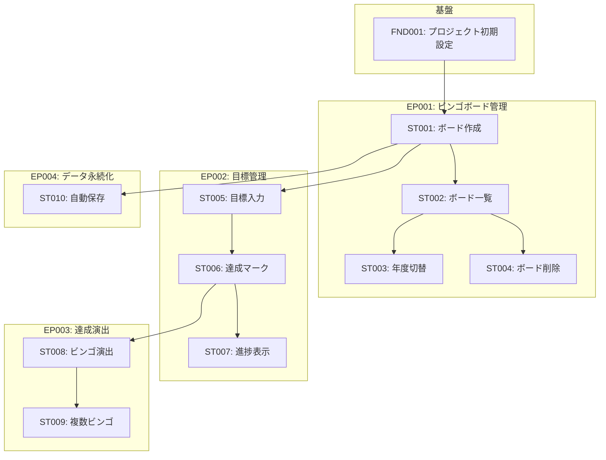
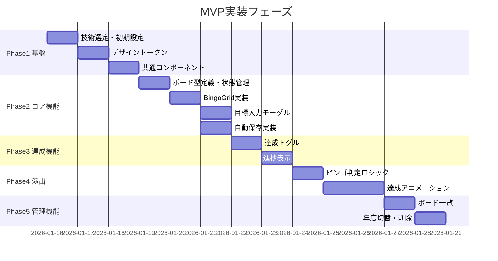
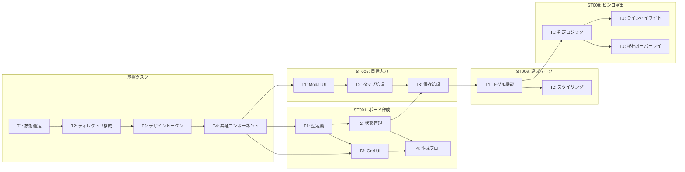
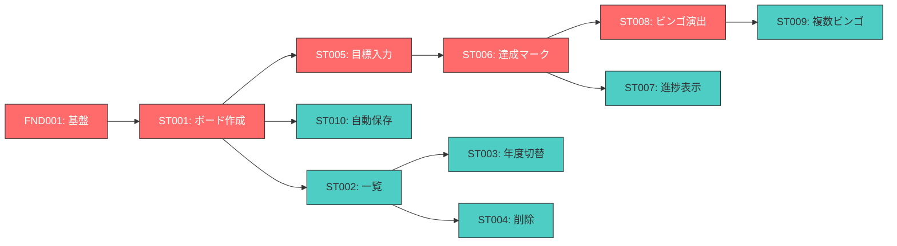

# 開発タスク依存関係図

## ストーリー依存関係

## フェーズ別実装順序

## タスク詳細依存関係

## クリティカルパス

## Epic別タスク構成

| Epic | Stories | Tasks | 推定時間 |
|------|---------|-------|---------|
| 基盤 | 1 | 4 | 5h |
| EP001: ビンゴボード管理 | 4 | 10 | 7.5h |
| EP002: 目標管理 | 3 | 7 | 5h |
| EP003: 達成演出 | 2 | 5 | 6h |
| EP004: データ永続化 | 1 | 3 | 2h |
| 合計 | 11 | 29 | 25.5h |
